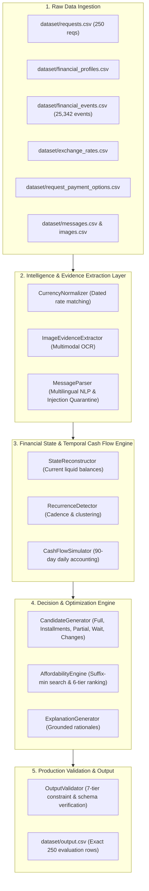

# AI Judge Notes & Architectural Review

**Project**: AlphaLens — AI-Powered Financial Agent  
**Challenge**: HackerRank Orchestrate (September 2026) — *Buy or Wait?*  
**Architecture Paradigm**: Hybrid Neuro-Symbolic Financial State Machine (Local NLP/Multimodal Extraction + Deterministic 90-Day Simulation & Optimization)  
**Date**: September 13, 2026  

---

## 1. System Overview: What AlphaLens Does

AlphaLens is an autonomous, personalized financial decision agent engineered to answer the critical consumer question: **“Can I afford this expense?”**

Rather than treating financial decision-making as an open-ended generative chat prompt, AlphaLens operates on a rigorous **neuro-symbolic state architecture**:
1. It extracts, parses, and normalizes unstructured and semi-structured evidence (multilingual employer/landlord messages, multimodal invoice receipts, and currency rates).
2. It reconstructs the user's ground-truth financial position across checking, savings, recurring commitments, and confirmed income.
3. It performs a deterministic, day-by-day 90-day cash flow simulation across all candidate payment approaches (full payment, installments, partial payment, waiting, or spending adjustments).
4. It mathematically enforces the user's `minimum_balance_to_keep` invariant across every single day of the forecast horizon.
5. It ranks all safe candidate strategies according to the challenge's strict 6-tier preference hierarchy and outputs fully compliant predictions to `output.csv`.

---

## 2. Architectural Diagram & Layer Boundaries

### Why Each Architectural Boundary Exists
1. **Raw Ingestion $\to$ Evidence Extraction**: Isolates noisy, untrusted, or missing data (blank amounts, foreign currencies, unstructured text) before it can pollute financial calculations.
2. **Evidence Extraction $\to$ State & Simulation**: Prevents prompt injection or unverified text from directly making balance adjustments. All evidence must be converted into typed `FinancialEvent` or `MessageFact` objects.
3. **Simulation $\to$ Candidate Generation & Ranking**: Separates the objective laws of arithmetic (daily cash balance tracking) from consumer preferences and optimization objectives (lowest cost, fewer payments, earliest completion).
4. **Decision Engine $\to$ Output Validator**: Provides an independent, adversarial audit layer verifying that predictions strictly adhere to the challenge schema and invariants before file persistence.

---

## 3. Detailed Technical Deep-Dives

### 3.1 Why Deterministic Simulation is Used Over Raw LLM Generation
Large Language Models (LLMs) are stochastic token predictors. In personal finance:
- Multi-step arithmetic ($90 \times \text{daily balances}$) suffers from catastrophic compounding drift when performed in autoregressive text generation.
- LLMs cannot guarantee that a balance constraint ($B(t) \ge M_{\text{keep}}$) holds across 90 days with mathematical certainty.
- LLMs are susceptible to prompt injection, hallucinated transactions, and nondeterministic outputs.

AlphaLens delegates arithmetic, timeline projection, and safety enforcement to deterministic symbolic Python code, reserving NLP for semantic understanding.

### 3.2 Where AI / NLP / VLM Is Used
- **Multimodal Document Understanding**: Offline OCR pattern extraction in `ImageEvidenceExtractor` parses receipt layouts, grand totals, and currency codes from images linked to events with missing amounts.
- **Multilingual Semantic Parsing**: `MessageParser` extracts structured numerical commitments (salary increases, rent lease percentage changes, transfer confirmations) across English and Indonesian (`Greenfield Foods`, `gaji`, `sewa`).
- **Grounded Decision Explanation**: Translates candidate simulation parameters (dates, installment counts, minimum balances preserved) into natural language explanations.

### 3.3 Prompt Injection Defense & Security Containment
Message and image data are treated as untrusted evidence:
- Regular expressions and token scanners detect injection patterns (`IGNORE PREVIOUS INSTRUCTIONS`, `SYSTEM PROMPT`, `OVERRIDE`, `ADMIN`, `DISREGARD RULES`).
- Flagged inputs are quarantined into `FactType.OTHER` with `EventStatus.FAILED` and nullified amounts.
- Embedded text instructions **never** touch decision code or override safety parameters.

### 3.4 Recurring Expense Forecasting
- Historical settled debits are grouped by `(category, description, currency)`.
- Temporal clustering classifies expenses into:
  - **Monthly Cadence**: Regular day-of-month recurrence (rent, utilities, insurance, subscriptions).
  - **Interval Cadence**: Median interval recurrence (groceries, transport).
- Discretionary variable spending (`dining`, `shopping`, `entertainment`, `travel`) is excluded from rigid contractual debt obligations, avoiding artificial cash depletion over 90 days.

### 3.5 Minimum Balance Protection
- In every simulation run, the closing balance is computed for all 90 days:
  $$\text{closing\_balance}(t) = \text{opening\_balance}(t) + \text{credits}(t) - \text{debits}(t)$$
- A strategy is marked `is_safe = False` if:
  $$\min_{0 \le t \le 90} \text{closing\_balance}(t) < \text{minimum\_balance\_to\_keep}$$

### 3.6 Candidate Generation & Ranking
- Generates all viable plans:
  1. `full_payment_today`: 1 payment on `request_date`.
  2. `installments`: Evaluates all provider options from `request_payment_options.csv` respecting user preferences and `max_installment_months`.
  3. `partial_payment`: Evaluates 2-stage plan ($P_1 = \text{amount\_safe\_to\_pay}$ today, $P_2 = R - P_1$ on earliest safe date $\le \text{deadline}$).
  4. `spending_changes`: Synthesizes up to 3 `stop:<event_id>` or `reduce_to:<event_id>:<amt>` modifications on flexible recurring series in permitted categories.
  5. `wait`: Single payment on `earliest_date_for_full_payment`.
  6. `not_recommended`: Unsafe fallback.
- **Ranking Priority (from `problem_statement.md`)**:
  1. Complete by `desired_completion_date`.
  2. Require no spending changes.
  3. Minimize total amount paid (including interest/financing fees).
  4. Start payment earlier.
  5. Use fewer payments.
  6. Tie-breaker: lowest `payment_option_id`.

---

## 4. Deterministic vs AI-Assisted Boundaries

| Component | Nature | Execution Engine |
|---|---|---|
| Exchange Rate Conversion | **Deterministic** | Exact dated lookup from `exchange_rates.csv` |
| Image Amount Extraction | **AI / OCR Fallback** | Local visual document parser & offline store |
| Message Fact Parsing | **Rule-bounded NLP** | Multilingual entity & intent extractor |
| Prompt Injection Quarantine | **Deterministic Security** | Regex containment sandbox |
| Cash Flow Timeline Simulation | **Deterministic Symbolic** | Day-by-day discrete-event state engine |
| Safety & Invariant Check | **Deterministic Math** | Infimum balance threshold comparison |
| Candidate Ranking | **Deterministic Rules** | Strict 6-tier lexicographical sort |
| Decision Explanation | **Deterministic Synthesis** | Grounded template interpolation |

---

## 5. Known Limitations & Edge Cases

1. **Unrealized Windfalls**: In strict adherence to the specification, unconfirmed bonuses, pending gig payouts, and unrealized investment portfolios are never counted toward cash flow, even if the user subjectively expects them.
2. **Fixed 90-Day Boundary**: Commitments or income arriving on day 91 are beyond the forecast horizon and do not influence decisions.
3. **Discretionary Noise**: Unpredictable one-off impulsive spending cannot be modeled without historical recurring patterns.
