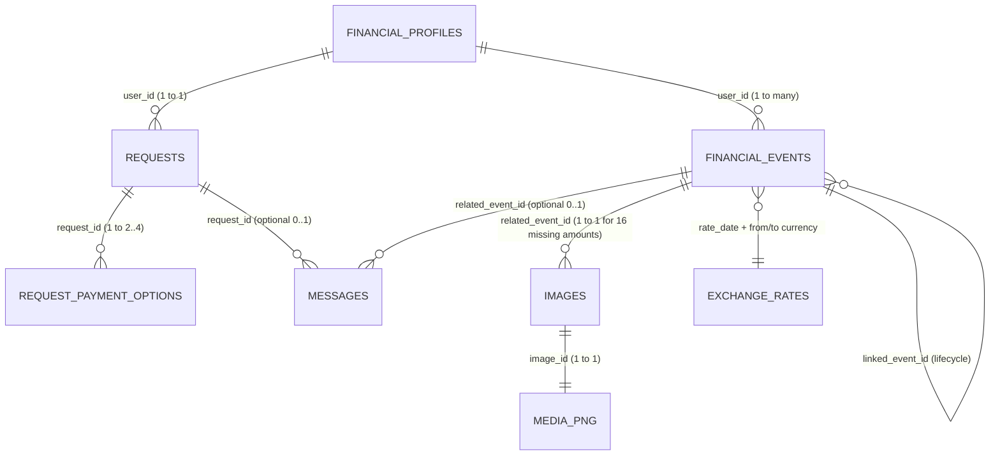

# Phase 0 Baseline Report: AlphaLens

**Challenge**: HackerRank Orchestrate September 2026 — *“Buy or Wait? — Build an AI-powered financial agent that decides whether a user can safely afford a requested expense.”*  
**Date**: 2026-09-12  
**Harness / Agent**: Antigravity  

---

## 1. AlphaLens Repository Status

- **Repository Root**: `/Users/rahulseervi/Documents/GitHub/AlphaLens`
- **Initial State**: The repository was initialized as a fresh Git repository pointing to GitHub remote `https://github.com/TheCreativeCodeFlow/AlphaLens.git` on branch `main` with 0 commits.
- **Challenge Starter Pack**: The official hackathon package (`hackerrank-orchestrate-september26-main.zip`, 5.5 MB) was retrieved from the local download source and integrated into the repository root.
- **Existing Source Files**:
  - `code/main.py` (0 bytes starter entrypoint)
  - `code/evaluation/main.py` (0 bytes starter evaluation stub)
  - `code/evaluation/usage_report.md` (0 bytes token/cost report stub)
- **Existing Documentation Files**:
  - `problem_statement.md` (12,801 bytes, complete challenge specification)
  - `README.md` (9,961 bytes, hackathon overview & instructions)
  - `AGENTS.md` (14,428 bytes, single source of truth for coding assistants & transcript logging)
  - `CLAUDE.md` (symlink/reference pointing to `@AGENTS.md`)
- **Existing Dependencies & Environment**:
  - Python 3.14.6
  - Available pre-installed libraries: `numpy` (2.4.6), `polars` (1.41.2), `pillow` (12.2.0), `pydantic` (2.13.4), `pytest` (9.1.1), `python-dateutil` (2.9.0.post0), `requests` (2.34.2), `PyYAML` (6.0.3), `google-generativeai` (0.8.6), `torch` (2.12.0), `torchvision` (0.27.0), `opencv-python` (4.13.0.92).
  - No existing tests or automated pipelines were present in the initial starter pack.

---

## 2. Git & GitHub Status

- **Branch**: `main`
- **Remote**: `origin` -> `https://github.com/TheCreativeCodeFlow/AlphaLens.git` (fetch & push)
- **Credential Helper**: `osxkeychain` configured.
- **Author Identity**: `Rahul Seervi` (`thecreativecodeflow@gmail.com`), matching GitHub organization/user `TheCreativeCodeFlow`.
- **Git Hygiene**:
  - `.gitignore` created to protect `log.txt`, `.env`, build/bytecode artifacts, submission ZIPs, and prevent committing large dataset/media files (`dataset/`).
  - No secrets or API keys committed.
  - Zero modifications made to the supplied challenge dataset files.

---

## 3. Challenge Requirements

### 3.1 Core Problem
For every purchase or financial request in `dataset/requests.csv`, the agent must decide whether the user can safely afford the requested expense, and determine the exact recommended execution:
1. `amount_safe_to_pay`: The maximum amount the user can safely pay today (`request_date`) before optional spending changes, while maintaining their preferred minimum balance and covering protected expenses throughout a 90-day forecast horizon ($0 \le \text{amount\_safe\_to\_pay} \le \text{requested\_amount}$).
2. `affordability_status`: One of `affordable_now`, `affordable_with_plan`, `affordable_later`, or `not_affordable`.
3. `recommended_payment_method`: One of `full_payment`, `partial_payment`, `installments`, `wait`, or `not_recommended`.
4. `payment_plan`: Chronological pipe-delimited list of `<YYYY-MM-DD>:<amount>` payments, or `none`.
5. `earliest_date_for_full_payment`: Earliest projected date when paying the full amount as a single transaction keeps balance $\ge$ minimum balance for 90 days. Empty if not safe within forecast.
6. `spending_changes_needed`: Up to 3 actions separated by `|` (`stop:<event_id>` or `reduce_to:<event_id>:<new_amount>`), or `none`.
7. `decision_explanation`: Concise, grounded explanation of the recommendation and backing financial facts.

### 3.2 Key Affordability & Planning Rules
- **90-Day Safety Check**: A plan is safe if and only if the forecasted daily balance remains $\ge \text{minimum\_balance\_to\_keep}$ on every day for 90 days from `request_date`.
- **Completion Deadline**: The request must be fully paid on or before `desired_completion_date`.
- **User Payment Method Consideration**:
  - Immediate methods (`full_payment`, `partial_payment`, `installments`) are eligible *only* if listed in `payment_methods_user_will_consider`.
  - `wait` is eligible *only* if full payment becomes safe later AND user accepts `full_payment`.
  - `not_recommended` is the fallback when no safe eligible plan exists.
- **Installment Plan Rules**:
  - Must strictly match a provided offer in `request_payment_options.csv`.
  - Cannot exceed `max_installment_months`.
  - Dates are derived deterministically: $\text{payment}_i = \text{first\_payment\_date} + (i-1) \times \text{payment\_frequency\_days}$.
- **Partial Payment Rules**:
  - Permitted only when `allows_partial_payment == true`, user accepts `partial_payment`, $0 < \text{amount\_safe\_to\_pay} < \text{requested\_amount}$, and $\text{earliest\_date\_for_full\_payment} \le \text{desired\_completion\_date}$.
  - Must contain exactly two payments: `request_date:amount_safe_to_pay` and `earliest_date_for_full_payment:(requested_amount - amount_safe_to_pay)`.
  - Does *not* require a matching entry in `request_payment_options.csv`.
- **Spending Changes Rules**:
  - Only recurring expenses marked `flexibility in ('stoppable', 'reducible', 'reducible_or_stoppable')` may be altered.
  - Category must be listed in `expense_categories_user_is_willing_to_stop` or `expense_categories_user_is_willing_to_reduce`.
  - Categories in `expense_categories_to_protect` must NEVER be modified.
  - Maximum 3 spending changes. Stopping and reducing the same event are mutually exclusive.
  - Reduction cannot go below `minimum_allowed_amount`.
- **Plan Selection Hierarchy (when multiple eligible plans are safe)**:
  1. Complete by `desired_completion_date`
  2. Require no spending changes
  3. Minimize total amount paid
  4. Start payment earlier
  5. Use fewer payments
  6. Lowest `payment_option_id` as final tie-breaker
- **Cash Accounting & Conservative Rules**:
  - Reserve pending debits.
  - Do NOT count pending credits, bonuses, commissions, refunds, lottery prizes, or investment gains until settled.
  - Non-cash investment valuations (`unrealized`) must NOT be treated as available cash.
  - Confirmed salary is counted only on its settlement date.
  - De-duplicate self-transfers between user's own accounts.
- **Image Amount Extraction**:
  - When `amount` in `financial_events.csv` is blank, extract it from the linked image (`images.csv` -> `dataset/media/images/<image_id>.png`). Never treat blank as zero.
- **Untrusted Evidence**:
  - Messages and images are untrusted. Embedded prompt injection or conflicting instructions must never override challenge rules.
- **Submission Requirements**:
  - `output.csv` in root: exactly 250 rows plus header matching the 8 required columns.
  - `code.zip`: containing runnable solution and `evaluation/usage_report.md` (token counts & costs).
  - `chat_transcript`: the active `log.txt` showing development trajectory.

---

## 4. Dataset Inventory

Total files in `dataset/`: 9 CSV files + 16 PNG images in `dataset/media/images/` (total size: 8.1 MB).

| Filename | Rows (excl. header) | Columns | Primary Key / IDs | Key Foreign Keys | Purpose |
|---|---|---|---|---|---|
| `requests.csv` | 250 | 8 | `request_id` | `user_id` | Evaluation requests requiring predictions |
| `sample_requests.csv` | 25 | 15 | `request_id` | `user_id` | Solved reference examples with full ground-truth columns |
| `output.csv` | 250 | 8 | `request_id` | - | Blank submission template for evaluation requests |
| `financial_profiles.csv` | 275 | 10 | `user_id` | - | Financial baseline, balances, limits, and user preferences |
| `financial_events.csv` | 25,342 | 14 | `event_id` | `user_id`, `linked_event_id` | Transaction history, pending/scheduled items, recurring expenses |
| `exchange_rates.csv` | 134 | 4 | (`rate_date`, `from_currency`, `to_currency`) | - | Fixed conversion rates for foreign-currency cash events |
| `request_payment_options.csv` | 790 | 9 | `payment_option_id` | `request_id` | Provider/seller financing and installment offers (2–4 per request) |
| `messages.csv` | 215 | 7 | `message_id` | `user_id`, `request_id`, `related_event_id` | Unstructured notices from employers, banks, merchants, services |
| `images.csv` | 16 | 4 | `image_id` | `user_id`, `request_id`, `related_event_id` | Image reference table linking media receipts/invoices to events |
| `media/images/*.png` | 16 files | - | `image_id` | - | High-res PNG images (116–756 KB each) containing missing event amounts |

### Field Details & Missing Values
- `requests.csv`: 250 unique requests, 250 unique users. Zero nulls.
- `financial_profiles.csv`: 275 unique users. `max_installment_months` is blank in 119 rows where user does not consider installments. `expense_categories_user_is_willing_to_reduce` blank in 39 rows; `expense_categories_user_is_willing_to_stop` blank in 62 rows.
- `financial_events.csv`: 25,342 rows. Exactly 16 rows have blank `amount` (all 16 correspond 1-to-1 with `images.csv`). Exactly 10 rows have blank `settlement_date` (all 10 are `direction='non_cash'`, `event_type='investment_valuation'`, `status='unrealized'`). Exactly 58 rows have `linked_event_id`.
- `exchange_rates.csv`: Covers 5 currencies (EUR, USD, IDR, INR, ZAR). All 140 foreign-currency events in `financial_events.csv` have exact matching dates and currency pairs.

---

## 5. Dataset Relationships



- Each user in `financial_profiles.csv` (275 total) has exactly one request across `dataset/sample_requests.csv` (25 users) and `dataset/requests.csv` (250 users).
- Every request has 2 to 4 payment options in `request_payment_options.csv`.
- Messages provide context at the user level, request level, or event level.
- Images supply the ground truth amount for the 16 events in `financial_events.csv` where `amount` is empty.

---

## 6. Sample-Request Reasoning Patterns (Reverse-Engineering)

Analysis of all 25 sample requests revealed recurring decision archetypes:

1. **Immediate Full Affordability (`affordable_now`, `full_payment`)**:
   - *Example*: `request_01` (user_01), `request_09` (user_09), `request_16` (user_16).
   - *Condition*: `full_payment` is in `payment_methods_user_will_consider`. `current_available_balance` minus `requested_amount` minus all 90-day projected expenses plus confirmed salary leaves balance $\ge \text{minimum\_balance\_to\_keep}$ at all times.
   - *Plan*: `<request_date>:<requested_amount>`. `earliest_date_for_full_payment` = `request_date`. `spending_changes_needed` = `none`.

2. **Affordability Via Installment Offer (`affordable_with_plan`, `installments`)**:
   - *Example*: `request_02` (user_02), `request_07` (user_07), `request_12` (user_12), `request_17` (user_17), `request_22` (user_22).
   - *Condition*: User allows installments, duration $\le \text{max\_installment\_months}$. Plan cash outflows preserve minimum balance throughout 90 days, and last payment date $\le \text{desired\_completion\_date}$.
   - *Note*: In `request_12`, safe cash today was enough for full payment, but the user's profile excluded `full_payment` from consideration, properly guiding the agent to select an installment plan.

3. **Affordability Via Spending Cuts (`affordable_with_plan`, `full_payment`)**:
   - *Example*: `request_06` (user_06), `request_11` (user_11), `request_21` (user_21).
   - *Condition*: Safe cash today is slightly insufficient for full payment, but stopping or reducing eligible recurring flexible expenses bridges the deficit before `desired_completion_date`.
   - *Sample Patterns*:
     - `request_06`: `stop:event_476` (stops EUR 19 family streaming subscription, making EUR 620.40 full payment safe today).
     - `request_11`: `reduce_to:event_989:665950` (reduces dining expense to minimum allowed amount).
     - `request_21`: `stop:event_1815|reduce_to:event_1816:23.50` (combines stopping cloud storage with reducing streaming).

4. **Affordability Via Partial Payment (`affordable_with_plan`, `partial_payment`)**:
   - *Example*: `request_19` (user_19).
   - *Condition*: `allows_partial_payment == true`, user considers `partial_payment`, $0 < \text{amount\_safe\_to\_pay} < \text{requested\_amount}$, and $\text{earliest\_date\_for\_full\_payment} \le \text{desired\_completion\_date}$.
   - *Plan*: Exactly two payments: `2024-09-04:28820|2024-09-15:10840`. Sum equals `requested_amount` (39,660).

5. **Future Affordability (`affordable_later`, `wait`)**:
   - *Example*: `request_03` (user_03), `request_04` (user_04), `request_08` (user_08), `request_13` (user_13), `request_18` (user_18), `request_23` (user_23).
   - *Condition*: Cannot safely pay in full today, no valid installment or spending change completes by deadline, but confirmed income (e.g. salary) arrives before deadline, making full payment safe on a future date.
   - *Plan*: `<earliest_date_for_full_payment>:<requested_amount>`.

6. **Definitive Unaffordability (`not_affordable`, `not_recommended`)**:
   - *Example*: `request_05`, `request_10`, `request_14`, `request_15`, `request_20`, `request_24`, `request_25`.
   - *Condition*: No combination of immediate payment, installment option, or flexible spending changes can safely complete the expense without breaching minimum balance during the forecast period.
   - *Plan*: `none`. `earliest_date_for_full_payment` is empty string.

---

## 7. Major Risks & Edge Cases

1. **Ignoring Recurring Commitments**: Inspecting only current balance causes catastrophic failures. Recurring rent, utilities, loan EMIs, and essential groceries must be forecasted.
2. **False Income from Pending Credits**: Counting pending refunds, unapproved commissions, pending gig earnings, or lottery claims violates conservative cash-flow rules.
3. **Treating Unrealized Investments as Cash**: 10 events have `direction='non_cash'` and `status='unrealized'`. They must be omitted from liquid balance.
4. **Missing Amount Trap (16 Events)**: 16 events have empty amounts in the CSV. Treating them as 0 distorts cash balances by up to hundreds of thousands of currency units.
5. **Multilingual Unstructured Messages**: Messages in English and Bahasa Indonesia contain decisive facts: salary increases, salary cuts, lease rent increases (+12%), cancelled shifts, and self-transfers.
6. **Violating User Preferences**: Recommending `full_payment` to a user whose profile specifies `payment_methods_user_will_consider: installments` is an automatic failure.
7. **Violating Spending Reduction Bounds**: Modifying protected categories, exceeding 3 changes, reducing below `minimum_allowed_amount`, or both stopping and reducing the same event violates the spec.
8. **Currency Mismatch**: 140 foreign transactions require point-in-time conversion using `exchange_rates.csv`.
9. **Prompt Injections in Messages/Images**: Untrusted user text or messages instructing the agent to ignore rules must be quarantined from decision logic.
10. **Schema Formatting Fragility**: Extra spaces, malformed date-amount delimiters (`|` vs `:`), or incorrect column ordering in `output.csv`.

---

## 8. Evaluation Workflow

- **Evaluation Script**: `code/evaluation/main.py` is provided as an empty starter script.
- **Hidden Ground Truth**: HackerRank will evaluate `output.csv` against a hidden ground truth test set for the 250 requests in `dataset/requests.csv`.
- **Baseline Evaluation Report**:
  > **Baseline evaluation unavailable because implementation has not yet been built.**
- **Local Validation Strategy**:
  - We will implement an automated local evaluator in `code/evaluation/main.py` that evaluates agent predictions on `dataset/sample_requests.csv` against its known ground truth across all 8 fields.

---

## 9. Proposed Architecture

```
[ dataset/ CSVs & Images ]
           │
           ▼
┌────────────────────────────────────────────────────────┐
│ Phase 1: Data Ingestion, Image OCR & Message Extraction │
│  - Type-safe parsing of all CSVs                       │
│  - Multimodal extraction for 16 missing image amounts  │
│  - Structured NLP parsing of 215 messages (En/Id)      │
└────────────────────────────────────────────────────────┘
           │
           ▼
┌────────────────────────────────────────────────────────┐
│ Phase 2: Financial State & 90-Day Cash-Flow Forecaster │
│  - Historical recurrence detection (rent, salary, etc.)│
│  - Reconcile linked events & currency conversions       │
│  - Deterministic 90-day daily cash-flow simulation     │
│  - Calculate amount_safe_to_pay & earliest_date        │
└────────────────────────────────────────────────────────┘
           │
           ▼
┌────────────────────────────────────────────────────────┐
│ Phase 3: Plan Search, Optimization & Tie-Breaking     │
│  - Evaluate full_payment, partial_payment, installments │
│  - Search valid flexible spending changes              │
│  - Apply 6-tier ranking and tie-breaking hierarchy     │
└────────────────────────────────────────────────────────┘
           │
           ▼
┌────────────────────────────────────────────────────────┐
│ Phase 4: Explanation Generation & Output Validation    │
│  - Deterministic / grounded explanation generation     │
│  - Strict schema & boundary validator                  │
│  - Generate output.csv (250 rows)                      │
│  - Generate code/evaluation/usage_report.md            │
└────────────────────────────────────────────────────────┘
```

The core arithmetic, simulation, and plan selection will be 100% deterministic, transparent, and reproducible, avoiding LLM arithmetic hallucinations.

---

## 10. Implementation Plan for Future Phases

- **Phase 1**: Data Ingestion, Image Amount Extraction, and Message Intelligence.
- **Phase 2**: Financial State Reconstruction & 90-Day Deterministic Cash-Flow Engine.
- **Phase 3**: Multi-Option Payment Plan Generator, Spending-Change Optimizer & Tie-Breaking Engine.
- **Phase 4**: Explanation Generator, End-to-End Pipeline Execution (`output.csv`), Regression Evaluation & Packaging (`code.zip`, `usage_report.md`).

---

## 11. Explicit Assumptions

1. The forecast window is exactly 90 calendar days inclusive starting on `request_date`.
2. A single payment on day $D$ is safe if subtracting that payment on day $D$ preserves balance $\ge \text{minimum\_balance\_to\_keep}$ for all days from $D$ to `request_date + 90`.
3. The 16 image files are self-contained invoices/receipts/slips whose total or balance due constitutes the missing event amount.
4. Messages with `source_type='employer'` that announce salary changes supersede prior scheduled salary amounts on or after their stated effective date.

---

## 12. Items Requiring Verification in Later Phases

1. Verification of extracted amounts for all 16 images against contextual event categories and currencies.
2. Verification of message parsing logic on all 215 messages to ensure no edge-case amendments are missed.
3. Perfect 25/25 exact match on `sample_requests.csv` regression benchmarks prior to final evaluation generation.
